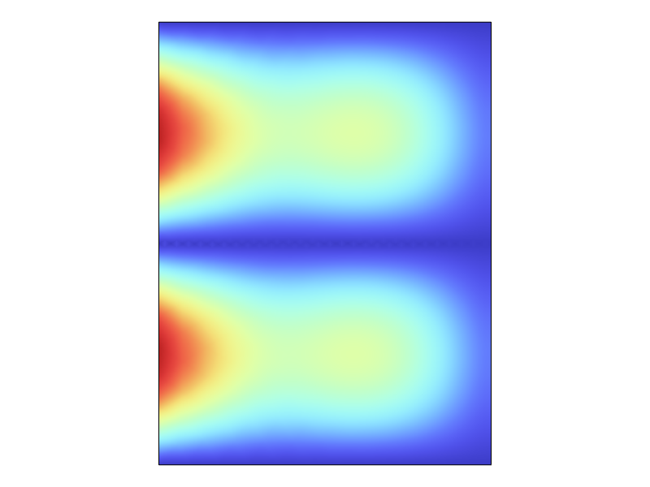
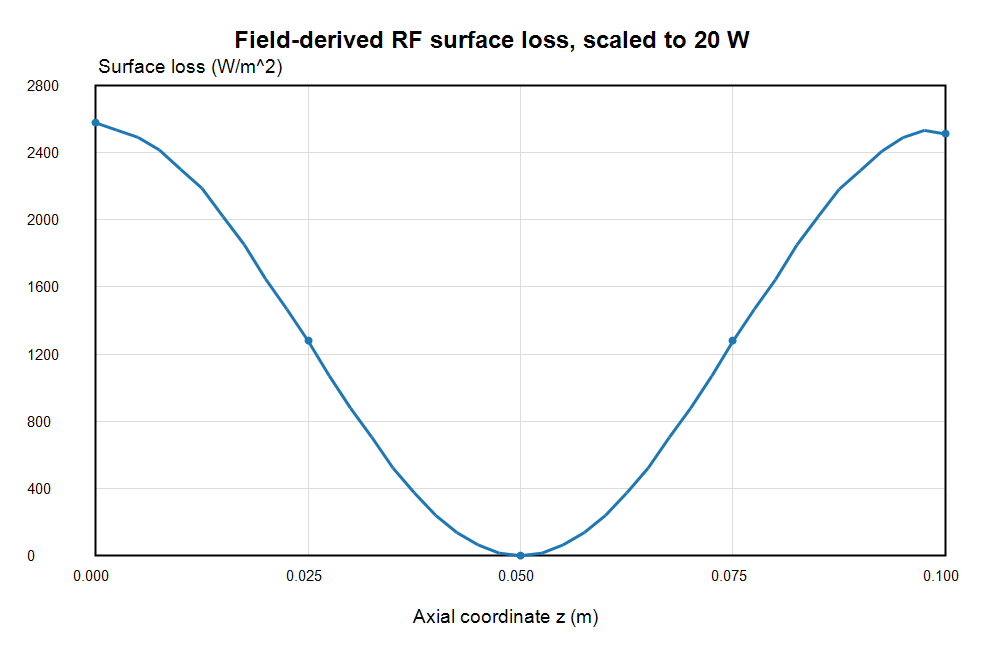
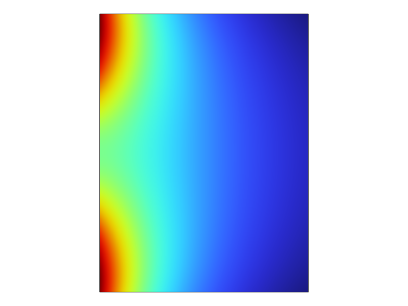
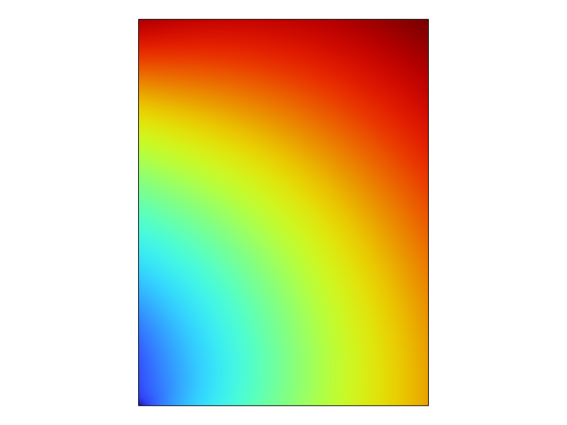
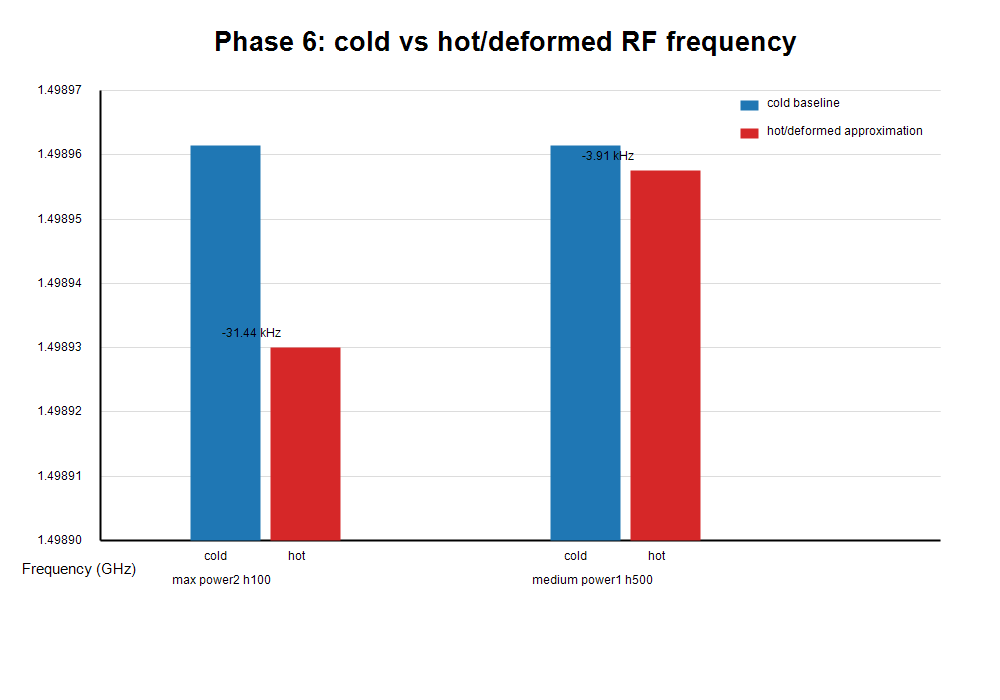
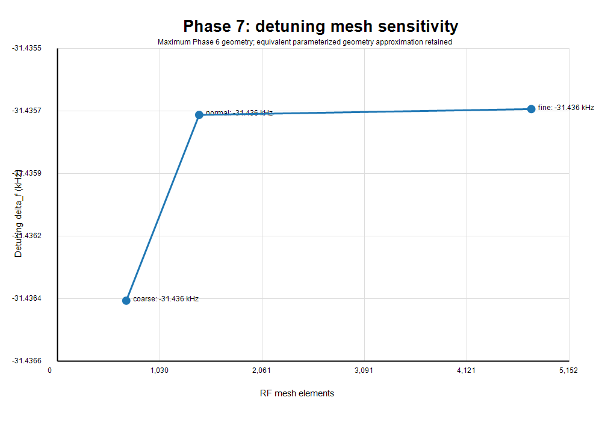

# RF Cavity Thermal Detuning Benchmark in COMSOL

A staged COMSOL benchmark that traces an RF cavity from cold eigenfrequency simulation to RF wall heating, thermal expansion, approximate geometry feedback, and thermal-detuning mesh sensitivity.

The project is organized as a validation workflow rather than a single black-box multiphysics model. Each step has a check: frequency reference, heat balance, displacement scale, coupling trend, hot/cold frequency comparison, or mesh sensitivity.

## Core Workflow

```mermaid
flowchart LR
    A["Cold RF eigenfrequency"] --> B["RF magnetic field"]
    B --> C["Field-derived wall loss"]
    C --> D["Heat flux boundary"]
    D --> E["Temperature field"]
    E --> F["Thermal expansion"]
    F --> G["Equivalent hot geometry"]
    G --> H["Hot RF eigenfrequency"]
    H --> I["Thermal detuning"]
    I --> J["RF mesh sensitivity"]
```



## What This Project Shows

- RF eigenfrequency simulation and mode filtering.
- Field-derived RF wall loss from magnetic-field magnitude and copper surface resistance.
- Thermal simulation with convection cooling and heat-balance validation.
- Thermal-to-structural coupling through copper thermal expansion.
- Approximate thermal detuning by feeding equivalent hot geometry back into the RF eigenfrequency model.
- RF mesh sensitivity to check whether the detuning result is numerically stable.

## Key Results

| Check | Result |
| --- | --- |
| Cold RF benchmark | First physical eigenfrequency agrees with COMSOL reference at about `1e-6` relative error |
| RF wall-loss heat source | Uses `q = 0.5 * Rs * |H_t|^2`, normalized to controlled total-power cases |
| RF-heated thermal balance | Input wall loss and convective removal close below `1e-8 W` |
| Thermal expansion scale | Displacement is consistent with `alpha * DeltaT * L` order of magnitude |
| Maximum-case detuning | About `-31.44 kHz`, relative detuning about `-2.1e-5` |
| Detuning mesh sensitivity | Coarse / normal / fine mesh spread about `0.63 Hz` |

## Project Map

| Phase | Purpose | Main report |
| --- | --- | --- |
| 1 | Cold RF eigenfrequency benchmark | `reports/phase1_em_benchmark.md` |
| 2 | Standalone thermal validation | `reports/phase2_thermal_benchmark.md` |
| 3 | Standalone structural thermal expansion | `reports/phase3_structural_benchmark.md` |
| 4 | RF-to-thermal mapping with constructed wall loss | `reports/phase4_rf_thermal_coupling.md` |
| 4b | Field-derived RF wall loss | `reports/phase4b_field_derived_rf_loss.md` |
| 5 | Temperature to structural expansion | `reports/phase5_thermal_structural_coupling.md` |
| 6 | Thermal detuning by equivalent geometry feedback | `reports/phase6_thermal_detuning.md` |
| 7 | Detuning mesh-sensitivity refinement | `reports/phase7_detuning_refinement.md` |

For a shorter overview, start here:

- `reports/final_project_summary.md`
- `docs/validation_logic.md`
- `reports/resume_and_interview_notes.md`

## Key Figures

RF field benchmark:



Field-derived wall-loss distribution:



RF-heated temperature field:



Thermal-to-structural displacement:



Cold vs hot RF frequency:



Detuning mesh sensitivity:



## Important Boundary

This repository is not claiming an industrial RF cavity design sign-off.

The Phase 6/7 thermal-detuning result uses an equivalent parameterized geometry approximation:

```text
a_hot      = a_cold      + average inner-wall radial displacement
b_hot      = b_cold      + average outer-wall radial displacement
height_hot = height_cold + average top-wall axial displacement
```

That means the RF model is rerun on updated geometry parameters, not on a full deformed mesh or full deformed RF boundary. The mesh-sensitivity result shows the equivalent-geometry detuning is numerically stable, but it does not remove the geometry-feedback approximation.

## Repository Contents

```text
docs/       Validation logic and project definition
reports/    Phase reports, final summary, interview notes
results/    Exported CSV tables and figures
tools/      COMSOL Java API scripts
handoff/    Continuation notes
```

## What Is Not Included

COMSOL binary model files are not committed:

```text
*.mph
*.mph.lock
*.mph.recovery
*.mph.status
```

COMSOL official application-library files, official PDFs, and large third-party reference repositories are also excluded. The repository keeps the reviewable parts: scripts, CSVs, figures, and reports.

## Next Improvements

- Map the full deformed RF boundary instead of reducing deformation to `a`, `b`, and `height`.
- Add a perturbation-theory estimate for the frequency shift.
- Repeat the workflow on a more realistic cavity geometry.

