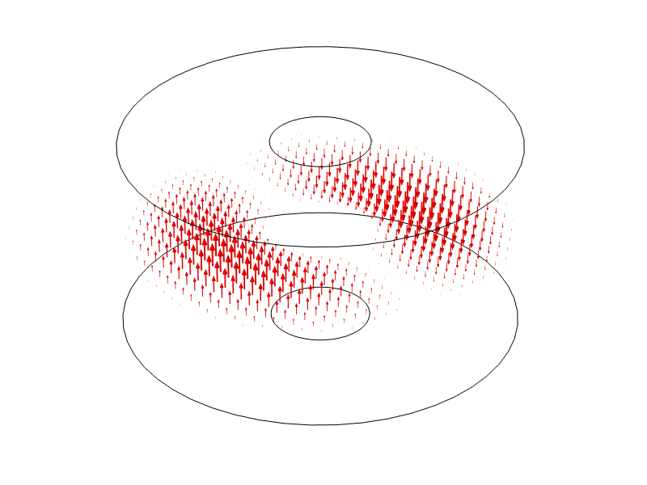

# Phase 1 EM Benchmark Report: COMSOL RF Cavity Eigenfrequency

Updated: 2026-06-26

## Scope

Phase 1 establishes a reproducible RF eigenfrequency benchmark in COMSOL. This phase verifies that the COMSOL RF Module can solve a cavity eigenfrequency problem, export the solved model, and produce referenceable numerical results.

This report does not claim thermal, structural, or coupled multiphysics completion. Those remain later phases.

## Model Source

The benchmark model is COMSOL's RF Module verification example:

```text
RF_Module\Verification_Examples\axisymmetric_cavity_resonator.mph
```

The installed application-library file at the path below was only a COMSOL Application Libraries preview file and could not be solved directly in batch mode:

```text
E:\COSMOL\comsol1\applications\RF_Module\Verification_Examples\axisymmetric_cavity_resonator.mph
```

The complete COMSOL 6.4 model was downloaded from the COMSOL model library:

```text
Application ID: 14517
Downloaded file: axisymmetric_cavity_resonator.mph
```

Saved project baseline model:

```text
E:\RND_Project_Portfolio\08_rf_cavity_cae_multiphysics\models\comsol\pillbox_cavity_baseline.mph
```

Supporting files:

```text
E:\RND_Project_Portfolio\08_rf_cavity_cae_multiphysics\models\comsol\pillbox_cavity_baseline_batch.log
E:\RND_Project_Portfolio\08_rf_cavity_cae_multiphysics\models\comsol\models.rf.axisymmetric_cavity_resonator.pdf
E:\RND_Project_Portfolio\08_rf_cavity_cae_multiphysics\results\phase1\frequency_table.csv
E:\RND_Project_Portfolio\08_rf_cavity_cae_multiphysics\results\phase1\mesh_statistics.csv
```

## Software Environment

| Item | Value |
| --- | --- |
| COMSOL version | COMSOL Multiphysics 6.4.0.293 |
| GUI launcher | `E:\COSMOL\comsol1\bin\win64\comsol.exe` |
| Batch launcher | `E:\COSMOL\comsol1\bin\win64\comsolbatch.exe` |
| Module exercised | RF Module |
| License error observed | No |
| Host noted in log | `DESKTOP-NJIE5UM` |
| CPU noted in log | Intel64 Family 6 Model 158 Stepping 13 |
| Cores noted in log | 8 cores visible |

## Solver Setup

| Item | Value |
| --- | --- |
| Study | `Study 1` |
| Solver type | Eigenfrequency |
| Physics | Electromagnetic Waves, Frequency Domain |
| Element order noted in log | Second-order Lagrange elements |
| Parametric sweep | `m_azimuthal = 0, 1, 2` |
| Desired eigenfrequencies | 12 modes near 2 GHz, per COMSOL model documentation |

## Numerical Results

### Frequency List

The following frequency list was extracted from the solved model dataset `dset2`, in GHz:

| Index | Frequency (GHz) | Classification |
| --- | ---: | --- |
| 0 | `1.4887962439549605e-9` | nonphysical/spurious near-zero mode |
| 1 | `1.9263038486328796e-9` | nonphysical/spurious near-zero mode |
| 2 | `5.122789811713979e-7` | nonphysical/spurious near-zero mode |
| 3 | `1.498961448338762` | first physical resonant mode |
| 4 | `1.9551474905175532` | physical candidate |
| 5 | `2.463636433743142` | physical candidate |
| 6 | `2.5980962073667313` | physical candidate |
| 7 | `2.9979272381867976` | physical candidate |
| 8 | `3.5791470939169323` | physical candidate |
| 9 | `3.6730531346425788` | physical candidate |
| 10 | `3.971578855663731` | physical candidate |
| 11 | `4.2450527149572155` | physical candidate |

The first three frequencies are close to zero and are treated as nonphysical/spurious modes. They are not used as benchmark resonant frequencies. This matches the COMSOL documentation guidance that physical modes should be identified from smoothly varying field patterns, while spurious modes can be mesh-dependent and nonphysical.

### Baseline Frequency

| Metric | Value |
| --- | ---: |
| Lowest physical resonant frequency | `1.498961448338762 GHz` |
| COMSOL documentation reference | `1.49896 GHz` |
| Absolute difference | `0.000001448338762 GHz` |
| Relative error | `9.662290935e-7` |
| Relative error percent | `9.662290935e-5 %` |

This agreement is sufficient for Phase 1 benchmark acceptance.

## Mesh And Solver Metrics

| Metric | Value |
| --- | ---: |
| Mesh tag | `mesh1` |
| Mesh elements | `428` |
| Mesh vertices | `241` |
| Mesh problems | `false` |
| Degrees of freedom | `3101` |
| COMSOL log total time | `16 s` |
| External batch elapsed time | `18.935 s` |
| Peak physical memory in log | `753 MB` |
| Peak virtual memory in log | `849 MB` |

COMSOL batch log reports no license checkout failure or solver failure. The solved model was saved successfully to the project baseline path.

## Exported Artifacts

Frequency table:

```text
E:\RND_Project_Portfolio\08_rf_cavity_cae_multiphysics\results\phase1\frequency_table.csv
```

Mesh statistics:

```text
E:\RND_Project_Portfolio\08_rf_cavity_cae_multiphysics\results\phase1\mesh_statistics.csv
```

Electric-field mode image exported from COMSOL plot group `pg1`:


3D field arrow image exported from COMSOL plot group `pg2`:



A separate mesh plot image was not exported in this run. Mesh statistics were exported through the COMSOL API and are used as the reproducible mesh record for Phase 1.

## Reproduction Command

```powershell
$batch = 'E:\COSMOL\comsol1\bin\win64\comsolbatch.exe'
$input = 'E:\RND_Project_Portfolio\08_rf_cavity_cae_multiphysics\models\comsol\axisymmetric_cavity_resonator_downloaded_6p4.mph'
$out = 'E:\RND_Project_Portfolio\08_rf_cavity_cae_multiphysics\models\comsol\pillbox_cavity_baseline.mph'
$log = 'E:\RND_Project_Portfolio\08_rf_cavity_cae_multiphysics\models\comsol\pillbox_cavity_baseline_batch.log'

& $batch -inputfile $input -outputfile $out -batchlog $log
```

Open the solved baseline in COMSOL GUI:

```powershell
Start-Process -FilePath 'E:\RND_Project_Portfolio\08_rf_cavity_cae_multiphysics\models\comsol\pillbox_cavity_baseline.mph'
```

## Phase 1 Conclusion

Phase 1 is complete as an RF eigenfrequency benchmark:

- The model source is documented.
- The complete COMSOL model is saved in the project.
- The RF eigenfrequency study solves successfully.
- Frequency, mesh, DOF, time, and memory metrics are recorded.
- The lowest physical resonant frequency agrees with the COMSOL reference value.
- Nonphysical near-zero modes are explicitly excluded from the benchmark frequency.

Recommended Phase 2 entry: keep the same geometry fixed, run a standalone thermal model with a controlled heat flux boundary condition, and scan the convection coefficient `h`. The goal is to validate monotonic thermal behavior before introducing RF wall-loss coupling.

## Cross-Check Status

Phase 1 has the strongest current cross-check in the project:

- It uses a COMSOL official RF Module verification example.
- The computed lowest physical mode is `1.498961448338762 GHz`.
- The COMSOL documentation reference is approximately `1.49896 GHz`.
- The relative error is `9.662290935e-7`.

This is a direct benchmark against an official reference/analytical verification case. Cross-software validation with ANSYS, CST, or an open-source solver has not yet been performed.
