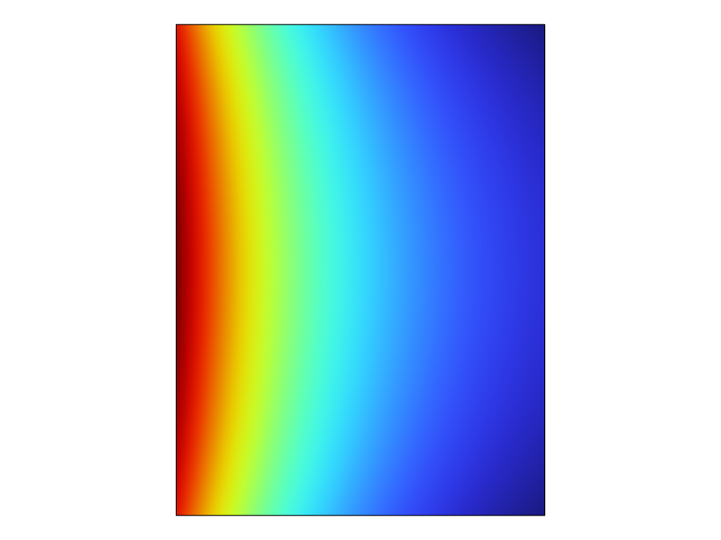
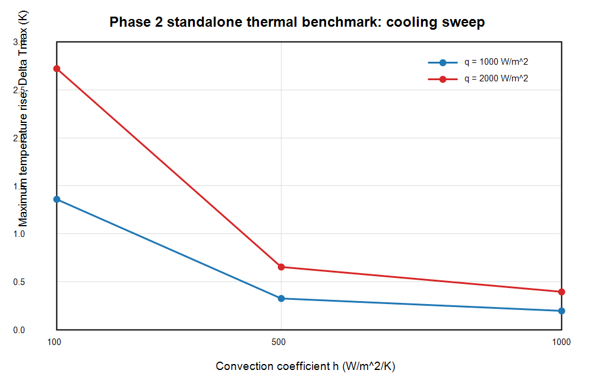

# Phase 2 Thermal Benchmark Report: Standalone Heat Transfer

Updated: 2026-06-26

## Scope

Phase 2 verifies a standalone thermal benchmark on the fixed Phase 1 cavity-wall geometry. The goal is to validate heat conduction, controlled heat-flux input, convection cooling, parameter sweep behavior, and steady-state heat balance.

This is not RF wall-loss coupling. No electromagnetic wall-loss distribution is used in this phase. No structural or multiphysics coupling is claimed.

## Model And Geometry

The thermal model reuses the Phase 1 axisymmetric cavity-wall cross-section dimensions:

| Parameter | Value |
| --- | --- |
| Inner radius `a` | `2.5 cm` |
| Outer radius `b` | `10 cm` |
| Height | `10 cm` |
| Geometry type | 2D axisymmetric rectangular wall section |
| Material | Copper baseline |
| Thermal conductivity | `400 W/(m*K)` |
| Density | `8960 kg/m^3` |
| Heat capacity | `385 J/(kg*K)` |
| Ambient temperature | `293.15 K` |

Generated COMSOL model:

```text
E:\RND_Project_Portfolio\08_rf_cavity_cae_multiphysics\models\comsol\phase2_standalone_thermal.mph
```

## Boundary Conditions

| Boundary group | Setting |
| --- | --- |
| Inner wall | Controlled uniform heat flux `q_flux` |
| Outer wall and end faces | Convective cooling, coefficient `h_conv` |
| Heat source type | Prescribed heat flux only |
| RF wall loss | Not used |

Parameter sweep:

```text
q_flux = 1000, 2000 W/m^2
h_conv = 100, 500, 1000 W/(m^2*K)
```

The six runs are explicit combinations of the two heat-flux levels and three cooling coefficients.

## Solver Metrics

| Metric | Value |
| --- | ---: |
| COMSOL version | COMSOL Multiphysics 6.4.0.293 |
| Study type | Stationary heat transfer |
| Mesh elements | `1426` |
| Mesh vertices | `762` |
| Java-measured solve elapsed time | `4.409 s` |
| License error observed | No |

## Results

Results are saved in:

```text
E:\RND_Project_Portfolio\08_rf_cavity_cae_multiphysics\results\phase2\thermal_cooling_sweep.csv
```

| q_flux (W/m^2) | h (W/m^2/K) | Tmax (K) | Avg wall T (K) | Max rise (K) | Input power (W) | Convective heat removed (W) |
| ---: | ---: | ---: | ---: | ---: | ---: | ---: |
| 1000 | 100 | 294.510775596640 | 294.459436154076 | 1.360775596640 | 15.707963267949 | 15.707963267979 |
| 1000 | 500 | 293.478176097548 | 293.426972405159 | 0.328176097548 | 15.707963267949 | 15.707963267956 |
| 1000 | 1000 | 293.348743255601 | 293.297698961556 | 0.198743255601 | 15.707963267949 | 15.707963267954 |
| 2000 | 100 | 295.871551193279 | 295.768872308151 | 2.721551193279 | 31.415926535898 | 31.415926535958 |
| 2000 | 500 | 293.806352195095 | 293.703944810318 | 0.656352195095 | 31.415926535898 | 31.415926535912 |
| 2000 | 1000 | 293.547486511203 | 293.445397923111 | 0.397486511203 | 31.415926535898 | 31.415926535906 |

Heat balance was evaluated using axisymmetric boundary integrals:

```text
Input power: integral(2*pi*r*q_flux)
Convective removal: integral(2*pi*r*h_conv*(T - T_amb))
```

The heat-balance residual is below `1e-10 W` in all six cases, so the steady-state energy balance is numerically consistent.

## Figures

Temperature field:



Cooling sweep trend:



## Acceptance Checks

| Acceptance criterion | Result |
| --- | --- |
| Increasing heat flux increases maximum temperature | Passed. At each `h`, doubling `q_flux` approximately doubles the temperature rise. |
| Increasing `h` decreases maximum temperature | Passed. For both heat-flux levels, Tmax decreases monotonically as `h` increases. |
| Convective heat removal is same order as heat input | Passed. Boundary-integral heat removal matches input power to numerical precision. |
| Standalone thermal benchmark only | Passed. No RF wall loss, EM coupling, or structural coupling is used. |

## Phase 2 Conclusion

Phase 2 is complete as a standalone thermal benchmark. The model demonstrates sensible heat-transfer trends and a clean steady-state heat balance on the fixed cavity-wall geometry.

Recommended Phase 3 entry: keep the thermal benchmark separate and add a standalone structural/thermal-expansion check driven by a controlled temperature field. Do not introduce RF wall-loss coupling until the standalone thermal and structural checks are both documented.

## Cross-Check Status

Phase 2 has been checked by physics trends and steady-state energy balance:

- Increasing imposed heat flux increases maximum temperature.
- Increasing convection coefficient `h` decreases maximum temperature.
- Axisymmetric input power `integral(2*pi*r*q_flux)` matches convective heat removal `integral(2*pi*r*h*(T-T_amb))`.
- The maximum heat-balance residual is below `1e-10 W`.

This is a standalone thermal sanity check, not a cross-software validation. A stronger future check would compare against a simplified cylindrical-wall thermal-resistance estimate or an independent solver.
