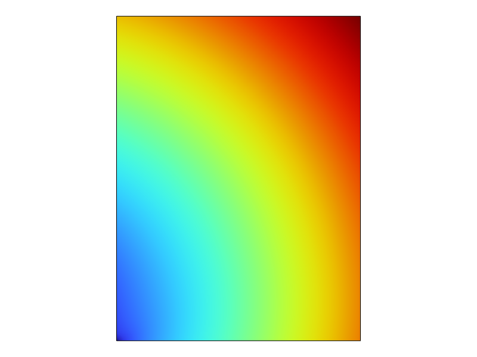
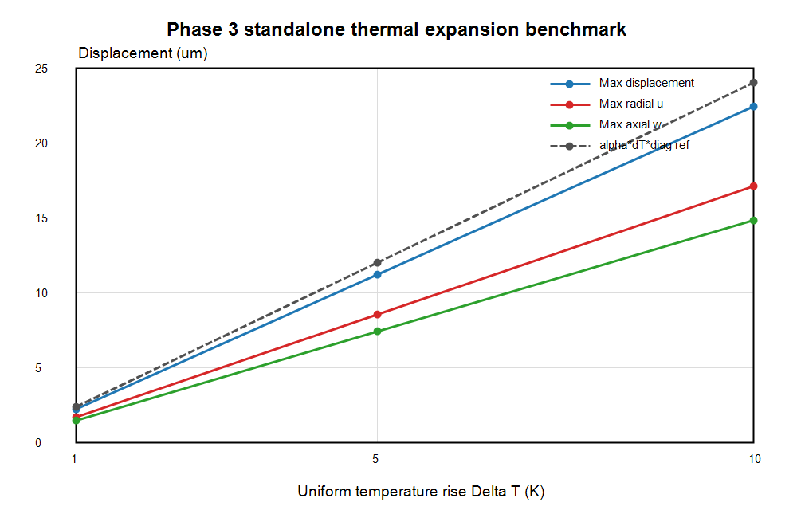

# Phase 3 Structural Benchmark Report: Standalone Thermal Expansion

Updated: 2026-06-26

## Scope

Phase 3 verifies a standalone structural/thermal-expansion benchmark on the fixed cavity-wall geometry. The purpose is to check Solid Mechanics setup, copper thermal expansion, minimal rigid-body constraints, displacement extraction, and the order-of-magnitude relation:

```text
delta_L ~= alpha * delta_T * L
```

This is not RF wall-loss coupling and not a full RF-thermal-structural coupled workflow. The imposed temperature rise is uniform and controlled.

## Model

Generated COMSOL model:

```text
E:\RND_Project_Portfolio\08_rf_cavity_cae_multiphysics\models\comsol\phase3_structural_thermal_expansion.mph
```

The model reuses the fixed 2D axisymmetric cavity-wall cross-section used in Phase 2:

| Parameter | Value |
| --- | --- |
| Inner radius `a` | `2.5 cm` |
| Outer radius `b` | `10 cm` |
| Wall radial thickness `b-a` | `7.5 cm` |
| Height | `10 cm` |
| Geometry type | 2D axisymmetric rectangular wall section |

## Structural Setup

| Item | Value |
| --- | --- |
| Physics | Solid Mechanics |
| Study | Stationary |
| Material | Copper baseline |
| Young's modulus | `110 GPa` |
| Poisson's ratio | `0.34` |
| Thermal expansion coefficient `alpha` | `17e-6 1/K` |
| Temperature input | Uniform `Tref + deltaT` |
| Reference temperature `Tref` | `293.15 K` |
| Sweep | `deltaT = 1, 5, 10 K` |
| Mesh elements | `1426` |
| Mesh vertices | `762` |
| Solve elapsed time | `3.809 s` |

Constraint strategy:

- One lower-left point is fixed to remove rigid-body translation.
- No global fixed boundary is applied.
- The setup is intentionally minimal so the body can thermally expand rather than being clamped.

## Results

Results CSV:

```text
E:\RND_Project_Portfolio\08_rf_cavity_cae_multiphysics\results\phase3\thermal_expansion_sweep.csv
```

| delta_T (K) | Max displacement (um) | Max radial u (um) | Max axial w (um) | Ref alpha*dT*0.1m (um) | Ref alpha*dT*diag (um) |
| ---: | ---: | ---: | ---: | ---: | ---: |
| 1 | 2.244851324745 | 1.712368247718 | 1.485630471512 | 1.700000000000 | 2.404163056034 |
| 5 | 11.224256623726 | 8.561841238590 | 7.428152357560 | 8.500000000000 | 12.020815280171 |
| 10 | 22.448513247452 | 17.123682477179 | 14.856304715121 | 17.000000000000 | 24.041630560343 |

The ratios are constant across the sweep:

| Metric | Ratio |
| --- | ---: |
| `max_disp / (alpha*dT*diag)` | `0.933735` |
| `max_radial_u / (alpha*dT*0.1m)` | `1.007275` |
| `max_axial_w / (alpha*dT*0.1m)` | `0.873900` |

This confirms that the displacement scale is consistent with `alpha * delta_T * L`.

## Figures

Displacement field:



Temperature-rise versus displacement trend:



## Acceptance Checks

| Acceptance criterion | Result |
| --- | --- |
| `delta_T` increase gives larger displacement | Passed. Max displacement scales linearly from `2.2449 um` to `22.4485 um`. |
| Displacement magnitude agrees with `alpha*delta_T*L` | Passed. Radial displacement agrees with the `0.1 m` reference within about 1%; max displacement is the same order as diagonal reference. |
| Minimal constraints used | Passed. A single fixed point removes rigid-body translation; no fully clamped boundary is used. |
| Standalone structural/thermal expansion only | Passed. No RF wall loss, thermal solve coupling, or full multiphysics coupling is used. |

## Phase 3 Conclusion

Phase 3 is complete as a standalone structural/thermal-expansion benchmark. The model uses copper thermal expansion under controlled uniform temperature rises and produces linear, order-consistent displacement results.

Recommended next step: introduce RF-to-thermal coupling only as Phase 4, after preserving the Phase 1 RF, Phase 2 thermal, and Phase 3 structural baselines as independent verification cases.

## Cross-Check Status

Phase 3 has been checked against the thermal-expansion order-of-magnitude formula:

```text
delta_L ~= alpha * delta_T * L
```

For `delta_T = 10 K`:

- Simulated maximum radial displacement: `17.123682477179 um`
- Reference scale: `alpha * delta_T * 0.1 m = 17 um`
- Simulated maximum displacement: `22.448513247452 um`
- Diagonal reference scale: `24.041630560343 um`

The response is linear across `1`, `5`, and `10 K`, and the displacement scale matches the analytical estimate. A stronger future check would vary the minimal constraint point and confirm that the displacement scale remains stable.
