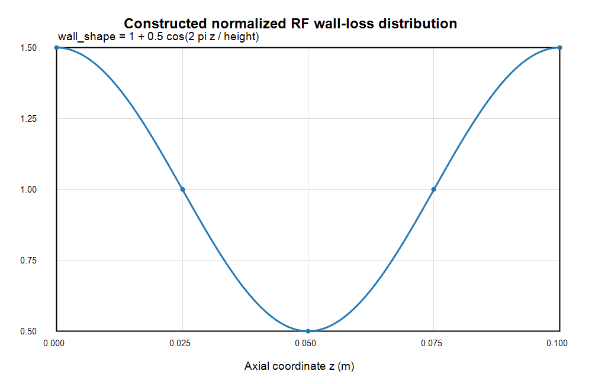
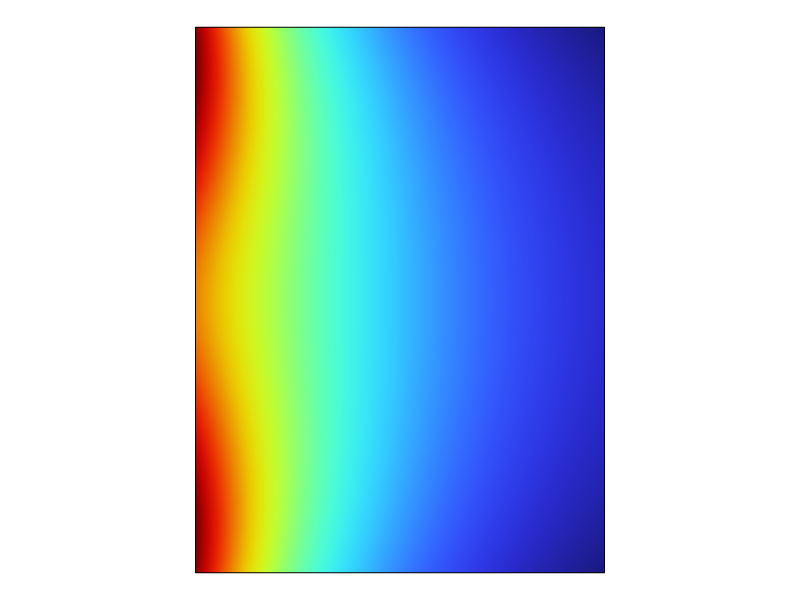
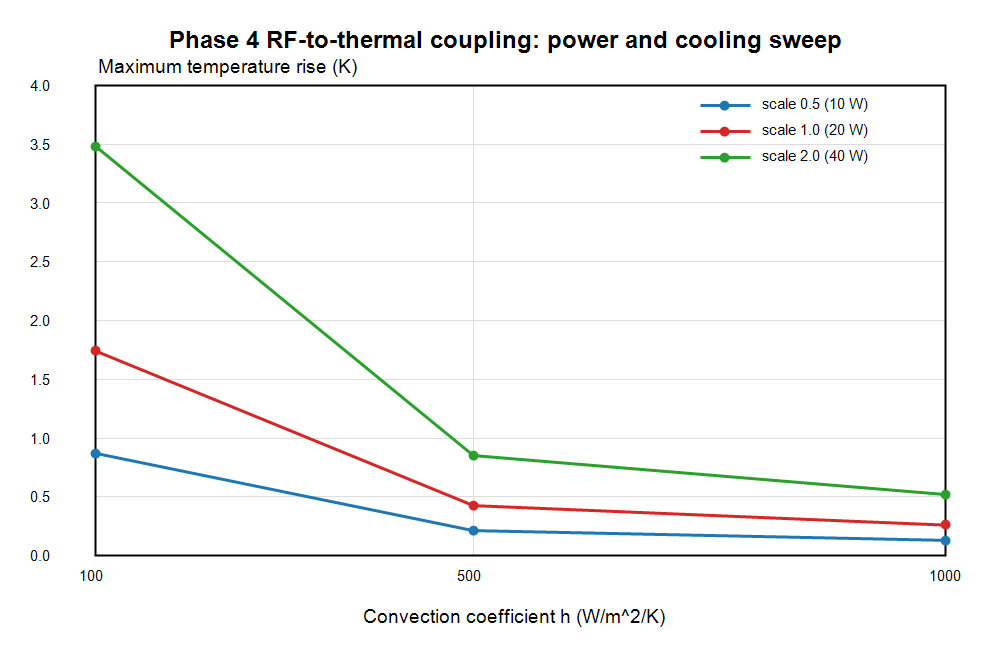

# Phase 4 RF-to-Thermal Coupling Report

Updated: 2026-06-26

## Scope

Phase 4 introduces RF wall loss as a heat source for the thermal model. This phase couples RF-style wall heating to heat transfer only.

This report does not include structural deformation, frequency detuning, or full RF-thermal-structural coupling.

## Model

Generated COMSOL model:

```text
E:\RND_Project_Portfolio\08_rf_cavity_cae_multiphysics\models\comsol\phase4_rf_thermal_coupling.mph
```

The model reuses the fixed 2D axisymmetric cavity-wall cross-section:

| Parameter | Value |
| --- | --- |
| Inner radius `a` | `2.5 cm` |
| Outer radius `b` | `10 cm` |
| Height | `10 cm` |
| Material | Copper baseline |
| Thermal conductivity | `400 W/(m*K)` |
| Ambient temperature | `293.15 K` |

## RF Wall-Loss Construction And Unit Conversion

For this Phase 4 benchmark, the wall-loss distribution is a constructed normalized boundary heat source. It is not yet a high-fidelity wall-loss distribution extracted from RF surface magnetic fields.

The imposed inner-wall heat flux is:

```text
wall_shape = 1 + 0.5*cos(2*pi*z/height)
wall_loss_flux = P0_rf * power_scale * wall_shape / (2*pi*a*height)
```

Units:

```text
P0_rf: W
power_scale: dimensionless
wall_shape: dimensionless, average value = 1 over z = 0..height
2*pi*a*height: m^2 inner-wall area
wall_loss_flux: W/m^2
```

Axisymmetric heat-input check:

```text
total_wall_loss = integral_inner_wall(2*pi*r*wall_loss_flux)
                = P0_rf * power_scale
```

Baseline RF power:

```text
P0_rf = 20 W
```

Power sweep:

| power_scale | Total wall loss |
| ---: | ---: |
| 0.5 | `10 W` |
| 1.0 | `20 W` |
| 2.0 | `40 W` |

Cooling sweep:

```text
h_conv = 100, 500, 1000 W/(m^2*K)
```

## Solver Metrics

| Metric | Value |
| --- | ---: |
| COMSOL version | COMSOL Multiphysics 6.4.0.293 |
| Study type | Stationary heat transfer |
| Mesh elements | `1426` |
| Mesh vertices | `762` |
| Solve elapsed time | `4.248 s` |
| License error observed | No |

## Results

Sweep CSV:

```text
E:\RND_Project_Portfolio\08_rf_cavity_cae_multiphysics\results\phase4\rf_thermal_sweep.csv
```

| power_scale | h (W/m^2/K) | total wall loss (W) | Tmax (K) | Avg wall T (K) | Max rise (K) | Convective heat removed (W) |
| ---: | ---: | ---: | ---: | ---: | ---: | ---: |
| 0.5 | 100 | 10 | 294.020860597770 | 293.983088771616 | 0.870860597770 | 10.000000000019 |
| 0.5 | 500 | 10 | 293.362990305244 | 293.325786552229 | 0.212990305244 | 10.000000000005 |
| 0.5 | 1000 | 10 | 293.280030184353 | 293.243470490406 | 0.130030184353 | 10.000000000004 |
| 1.0 | 100 | 20 | 294.891721195541 | 294.816177543231 | 1.741721195541 | 20.000000000038 |
| 1.0 | 500 | 20 | 293.575980610489 | 293.501573104455 | 0.425980610489 | 20.000000000009 |
| 1.0 | 1000 | 20 | 293.410060368705 | 293.336940980811 | 0.260060368705 | 20.000000000005 |
| 2.0 | 100 | 40 | 296.633442391082 | 296.482355086462 | 3.483442391082 | 40.000000000076 |
| 2.0 | 500 | 40 | 294.001961220978 | 293.853146208910 | 0.851961220978 | 40.000000000018 |
| 2.0 | 1000 | 40 | 293.670120737410 | 293.523881961621 | 0.520120737411 | 40.000000000010 |

The heat-balance residual is below `1e-10 W` in all nine cases.

## Figures

Constructed wall-loss distribution:



RF-heating temperature field:



Power and cooling sweep trend:



## Acceptance Checks

| Acceptance criterion | Result |
| --- | --- |
| RF wall loss total power recorded | Passed. Total wall loss is `10`, `20`, and `40 W` for power scales `0.5`, `1.0`, and `2.0`. |
| Heat input and convection removal balance | Passed. Residual is below `1e-10 W` in all cases. |
| Increasing RF power scale increases temperature rise | Passed at each `h`. |
| Increasing `h` decreases temperature rise | Passed at each power scale. |
| Scope remains RF-to-thermal only | Passed. No structural deformation or frequency detuning is solved. |

## Phase 4 Conclusion

Phase 4 is complete as an RF-to-thermal coupling benchmark with a documented, normalized wall-loss heat source. The result verifies the heat-input mapping, total-power accounting, convection heat balance, and expected power/cooling trends.

Next recommended step: replace the constructed wall-loss distribution with a field-derived RF surface loss from the Phase 1 RF solution, then rerun the same heat-balance and cooling-sensitivity checks before any structural or detuning coupling is introduced.
