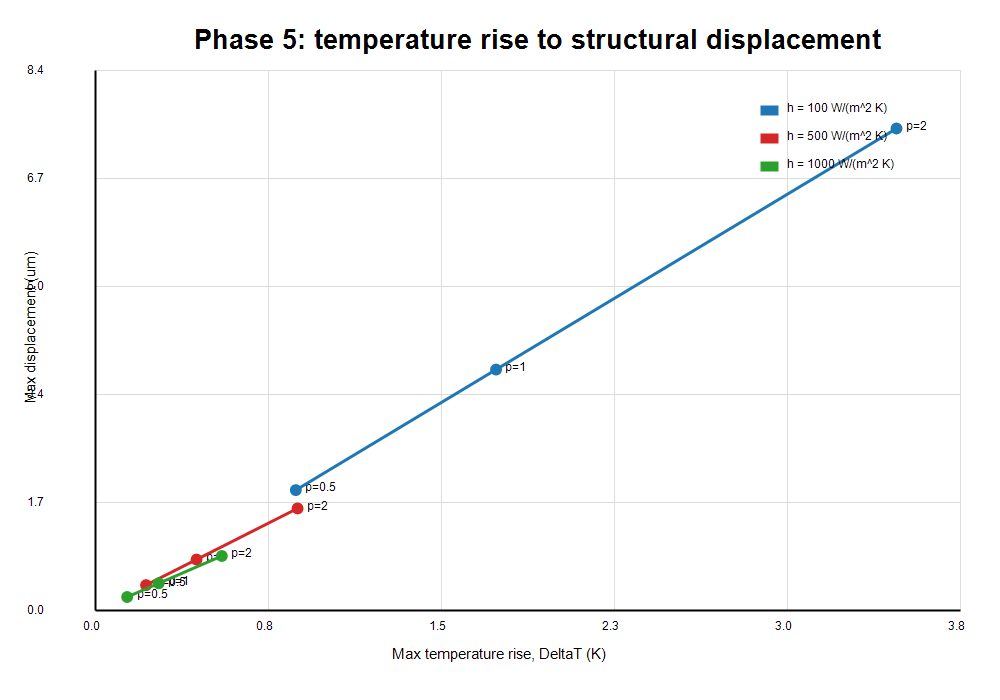

# Phase 5 Thermal-to-Structural Coupling Report

Updated: 2026-06-26

## Scope

Phase 5 couples the Phase 4b field-derived RF heat source into a stationary thermal solve, then passes the resulting temperature field to Solid Mechanics through copper thermal expansion.

This phase is thermal-to-structural coupling only. It does not perform a deformed-geometry RF eigenfrequency solve, does not calculate thermal detuning, and does not claim full RF-thermal-structural coupling.

## Model

Generated COMSOL model:

```text
E:\RND_Project_Portfolio\08_rf_cavity_cae_multiphysics\models\comsol\phase5_thermal_structural_coupling.mph
```

The model reuses the fixed 2D axisymmetric cavity-wall cross-section:

| Parameter | Value |
| --- | --- |
| Inner radius `a` | `2.5 cm` |
| Outer radius `b` | `10 cm` |
| Height | `10 cm` |
| Material | Copper baseline |
| Thermal conductivity | `400 W/(m*K)` |
| Young's modulus | `110 GPa` |
| Poisson's ratio | `0.34` |
| Thermal expansion coefficient `alphaCu` | `17e-6 1/K` |
| Reference temperature | `293.15 K` |

## Coupling Definition

Thermal input uses the audited Phase 4b field-derived RF heat source:

```text
field_wall_shape = 2*cos(pi*z/height)^2
wall_loss_flux = P0_rf*power_scale*field_wall_shape/(2*pi*a*height)
P0_rf = 20 W
```

The thermal solution `T` is passed directly to the Solid Mechanics thermal-expansion feature:

```text
thermal expansion temperature = T
thermal expansion reference temperature = Tref = 293.15 K
```

Structural constraint strategy:

- One lower-left point is fixed to remove rigid-body drift.
- No full edge clamp is applied.
- The cavity wall is allowed to expand under the nonuniform RF-heating temperature field.

Parameter sweep:

```text
power_scale = 0.5, 1.0, 2.0
h_conv = 100, 500, 1000 W/(m^2*K)
```

## Solver Metrics

| Metric | Value |
| --- | ---: |
| COMSOL version | COMSOL Multiphysics 6.4.0.293 |
| Study type | Stationary heat transfer + Solid Mechanics |
| Mesh elements | `1426` |
| Mesh vertices | `762` |
| Degrees of freedom reported in log | `8847` |
| Solve elapsed time from Java timer | `7.774 s` |
| COMSOL log total time | `24 s` |
| Peak physical memory in log | about `1.22 GB` |
| License error observed | No |

## Results

Sweep CSV:

```text
E:\RND_Project_Portfolio\08_rf_cavity_cae_multiphysics\results\phase5\thermal_structural_sweep.csv
```

| power_scale | h (W/m^2/K) | total wall loss (W) | Tmax (K) | Max rise (K) | Max disp (um) | Max radial (um) | Max axial (um) | Radius change (um) | Length change (um) |
| ---: | ---: | ---: | ---: | ---: | ---: | ---: | ---: | ---: | ---: |
| 0.5 | 100 | 10 | 294.029911908801 | 0.879911908801 | 1.872495614748 | 1.422731994009 | 1.294385394758 | 0.334880775374 | 0.524302666215 |
| 0.5 | 500 | 10 | 293.371857259425 | 0.221857259425 | 0.396973679640 | 0.297183779299 | 0.317071318806 | 0.068737421706 | 0.130382564664 |
| 0.5 | 1000 | 10 | 293.288675514951 | 0.138675514951 | 0.212205649603 | 0.156223443968 | 0.193830150919 | 0.035431250193 | 0.080618671087 |
| 1.0 | 100 | 20 | 294.909823817603 | 1.759823817603 | 3.744991229497 | 2.845463988017 | 2.588770789516 | 0.669761550747 | 1.048605332430 |
| 1.0 | 500 | 20 | 293.593714518851 | 0.443714518851 | 0.793947359279 | 0.594367558598 | 0.634142637612 | 0.137474843411 | 0.260765129328 |
| 1.0 | 1000 | 20 | 293.427351029901 | 0.277351029901 | 0.424411299207 | 0.312446887936 | 0.387660301838 | 0.070862500386 | 0.161237342174 |
| 2.0 | 100 | 40 | 296.669647635205 | 3.519647635205 | 7.489982458994 | 5.690927976034 | 5.177541579032 | 1.339523101495 | 2.097210664859 |
| 2.0 | 500 | 40 | 294.037429037701 | 0.887429037701 | 1.587894718558 | 1.188735117196 | 1.268285275225 | 0.274949686822 | 0.521530258655 |
| 2.0 | 1000 | 40 | 293.704702059802 | 0.554702059802 | 0.848822598414 | 0.624893775872 | 0.775320603675 | 0.141725000771 | 0.322474684347 |

## Order-of-Magnitude Check

The structural scale is checked against:

```text
displacement_scale ~= alpha * DeltaT * L
```

For the largest case, `power_scale = 2.0`, `h = 100 W/(m^2*K)`:

```text
DeltaT = 3.519647635205 K
alpha * DeltaT * 0.1 m = 5.983400979848 um
alpha * DeltaT * sqrt(0.1^2 + 0.1^2) m = 8.461806814818 um
COMSOL max displacement = 7.489982458994 um
```

The maximum displacement is the same order as the thermal-expansion estimate and falls between the `0.1 m` and diagonal representative length scales. Across the sweep, `max_disp / (alpha*DeltaT*diag)` ranges from about `0.636` to `0.885`, which is acceptable for a nonuniform temperature field and minimally constrained body.

## Figures

Temperature-to-displacement trend:



Displacement field from RF heating:


An additional temperature-field image from the same run is available:

```text
E:\RND_Project_Portfolio\08_rf_cavity_cae_multiphysics\results\phase5\temperature_field_from_rf_heating.png
```

## Acceptance Checks

| Acceptance criterion | Result |
| --- | --- |
| Power increase raises temperature and displacement | Passed. For each `h`, both maximum temperature rise and maximum displacement increase with `power_scale`. |
| Larger `h` lowers temperature and displacement | Passed. For each `power_scale`, both maximum temperature rise and maximum displacement decrease as `h` increases. |
| Displacement scale matches `alpha*DeltaT*L` | Passed. Maximum displacement is within the expected `alpha*DeltaT*L` order of magnitude. |
| Phase remains thermal-to-structural only | Passed. No deformed RF eigenfrequency or thermal detuning solve is included. |
| No thermal detuning claim | Passed. This report records deformation only; RF feedback is future work. |

## Phase 5 Conclusion

Phase 5 is complete as a thermal-to-structural coupling benchmark driven by the Phase 4b field-derived RF heat source. It verifies that the thermal field maps into copper thermal expansion, that displacement follows the expected power/cooling trends, and that the displacement magnitude is consistent with `alpha*DeltaT*L`.

Recommended next step: a separately scoped detuning phase may use the Phase 5 displacement/deformed geometry as input to a new RF eigenfrequency comparison, but thermal detuning has not been completed in Phase 5.
