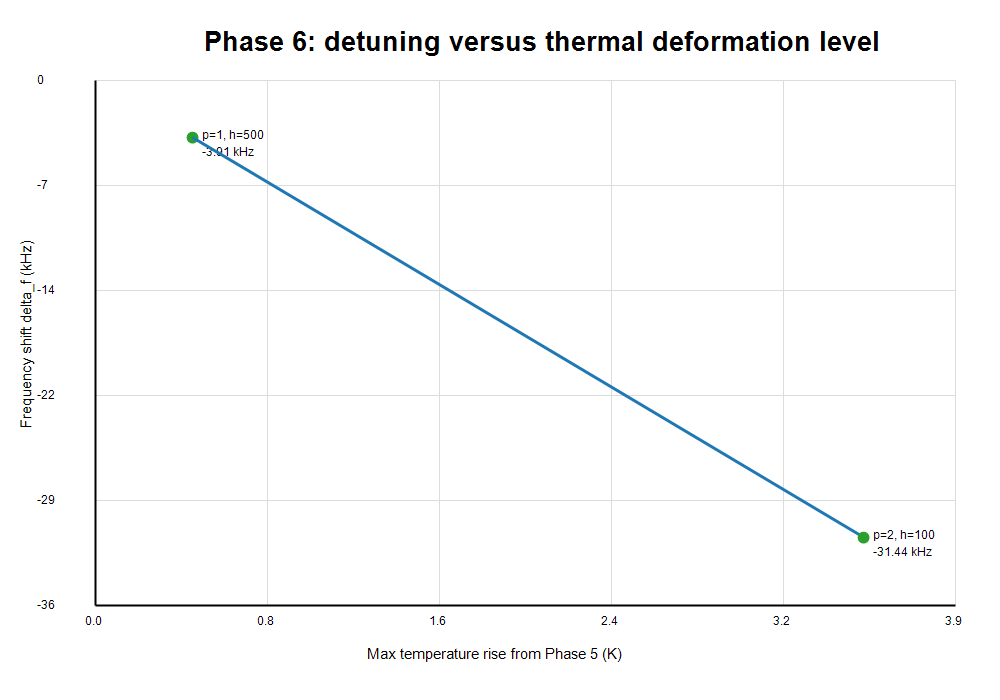

# Phase 6 Thermal Detuning / Deformed-Geometry RF Eigenfrequency Comparison

Updated: 2026-06-26

## Scope

Phase 6 performs the first thermal-detuning comparison in this project. It feeds Phase 5 thermal-expansion results back into the RF eigenfrequency benchmark and compares the resulting hot/deformed RF frequency against the cold Phase 1 baseline.

This phase does not claim a full closed-loop RF-thermal-structural workflow. The geometry feedback is an equivalent parameterized-geometry approximation, not a direct deformed-mesh RF solve.

## Cold RF Baseline

Cold model:

```text
E:\RND_Project_Portfolio\08_rf_cavity_cae_multiphysics\models\comsol\pillbox_cavity_baseline.mph
```

Cold first physical frequency:

```text
1.498961448338762 GHz
```

The first three near-zero eigenfrequencies remain classified as nonphysical/spurious and are excluded from the detuning comparison. The compared mode is the first physical mode, consistent with Phase 1.

## Geometry Feedback Method

Direct deformed-mesh RF geometry transfer was not used in this run. Instead, Phase 6 uses an equivalent parameterized-geometry approximation:

```text
a_hot      = a_cold      + average inner-wall radial displacement
b_hot      = b_cold      + average outer-wall radial displacement
height_hot = height_cold + average top-wall axial displacement
```

Cold geometry:

```text
a_cold = 0.025 m
b_cold = 0.100 m
height_cold = 0.100 m
```

For each selected Phase 5 case, the Phase 1 RF model was reloaded from the cold baseline, the COMSOL parameters `a`, `b`, and `height` were updated, the geometry and mesh were rebuilt, and the original RF eigenfrequency study `std1` was rerun.

Saved hot RF model:

```text
E:\RND_Project_Portfolio\08_rf_cavity_cae_multiphysics\models\comsol\phase6_thermal_detuning.mph
```

The saved model corresponds to the maximum thermal-deformation case:

```text
power_scale = 2.0
h = 100 W/(m^2*K)
```

## Selected Thermal-Deformation Cases

| Case | power_scale | h (W/m^2/K) | max DeltaT (K) | delta a (um) | delta b (um) | delta height (um) |
| --- | ---: | ---: | ---: | ---: | ---: | ---: |
| Maximum | 2.0 | 100 | 3.519647635205 | 1.339523101495 | 3.621361612172 | 2.097210664859 |
| Medium | 1.0 | 500 | 0.443714518851 | 0.137474843411 | 0.395567436433 | 0.260765129328 |

## RF Eigenfrequency Results

Result CSV:

```text
E:\RND_Project_Portfolio\08_rf_cavity_cae_multiphysics\results\phase6\thermal_detuning_results.csv
```

| Case | Cold frequency (GHz) | Hot frequency (GHz) | delta_f (kHz) | Relative detuning |
| --- | ---: | ---: | ---: | ---: |
| Maximum: `power_scale=2.0`, `h=100` | 1.498961448338762 | 1.498930011671201 | -31.436667560891 | -2.097229891785e-5 |
| Medium: `power_scale=1.0`, `h=500` | 1.498961448338762 | 1.498957539588848 | -3.908749914627 | -2.607638721436e-6 |

The maximum case produced the following hot frequency list from `dset2`, in GHz:

```text
9.012948844914229e-10
1.2658142155892364e-7
4.6659990012775757e-7
1.4989300116712012
1.9550889814412953
2.4635708702922194
2.5980232254042046
2.9978643611410933
3.5790624600450798
3.672962913559512
3.9714587850286356
4.244929276327453
```

The first three entries are near-zero nonphysical/spurious modes. The first physical hot frequency is therefore:

```text
1.4989300116712012 GHz
```

## Solver Metrics

| Case | Mesh elements | Mesh vertices | RF solve elapsed time |
| --- | ---: | ---: | ---: |
| Maximum | 428 | 241 | 6.501 s |
| Medium | 428 | 241 | 4.446 s |

COMSOL batch completed without license errors.

## Figures

Cold versus hot/deformed RF frequency:


Detuning versus thermal deformation level:



## Acceptance Checks

| Acceptance criterion | Result |
| --- | --- |
| Cold and hot frequencies recorded | Passed. Cold is `1.498961448338762 GHz`; hot frequencies are listed for both selected thermal cases. |
| `delta_f` and relative detuning reported | Passed. Maximum case gives `-31.436667560891 kHz`, relative detuning `-2.097229891785e-5`. |
| Geometry feedback method documented | Passed. Phase 6 uses equivalent parameterized geometry from Phase 5 average boundary displacements. |
| Not only a structural estimate | Passed. RF eigenfrequency studies were rerun after geometry parameters were updated. |
| Approximation clearly labeled | Passed. This is not a direct deformed-mesh RF solve. |

## Phase 6 Conclusion

Phase 6 is complete as an approximate thermal-detuning validation. The Phase 5 deformation was fed back into the Phase 1 RF eigenfrequency model through equivalent geometry parameters, and the RF eigenfrequency was recalculated.

For the maximum selected heating case, the first physical RF frequency shifts from:

```text
cold: 1.498961448338762 GHz
hot:  1.4989300116712012 GHz
```

The resulting detuning is:

```text
delta_f = -31.436667560891 kHz
relative detuning = -2.097229891785e-5
```

This is the first valid thermal-detuning result in the project, with the important limitation that the geometry feedback is an equivalent parameterized approximation. A higher-fidelity future step would export or map the full deformed RF boundary rather than reducing deformation to `a`, `b`, and `height` changes.
